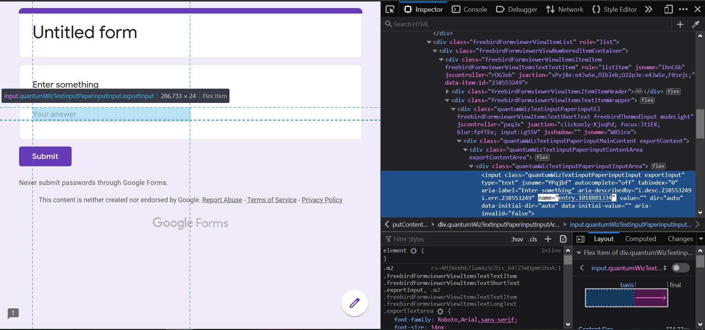
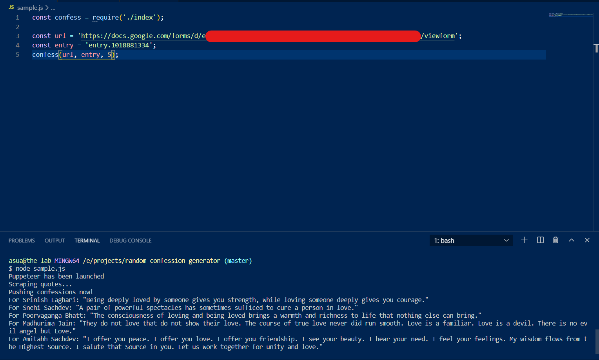

# Source code of random-confession-generator

*The main aim of this script is to just act as a skeleton for generating random stuff and posting them in places like google forms which
aim to spam individuals.*

Some of my friends were troubled by some confession pages of our institute, so made this random confessions generator that bombarded the google forms of those pages.

However, due to flexible nature of puppeteer, you can basically create random stuff and bombard any form with any generated stuff. Just use a different page to scrape stuff off. I used a romantic quotes page, cause that's what I needed for my purposes. But you could basically use anything since this a well written skeleton structure for doing fun things with puppeteer.

## Usage:

```
npm i random-confession-generator
```
You need two things to run the script:
* The **URL** of the google form
* The 'entry point' of the text-box where you want to bombard.
* The number of confessions you want to make.

The 'entry point' of the text-box is basically the name of that element and can
be easily found by inspecting that elemnt using dev tools.



Now, in your JS file require the package and run the confess function:

```js
const confess = require('random-confession-generator');

const url = 'https://docs.google.com/forms/d/e/******************__gTha9NzQ/viewform';

const entry = 'entry.1018881334';

const count = 10;

confess(url, entry, count);
```
Run the file and you'll find the confessions being logged in your console!

Sample:


## If you want to customise it for other purposes:

Clone this repo & Run:

```
git clone git@github.com:vaibhavrajsingh2001/random-confession-generator.git

npm install
```
Edit the sample.js file and run it.

Note: \
This will install the `puppeteer` and the `random-indian-name generator` libraries. Since I wasn't sure that everyone will have chromium setup on their systems and even if they had, they probably won't want to setup the path inside the script, so this will also install a small chromium package too. So, might take some time to install the dependencies, just note that.
